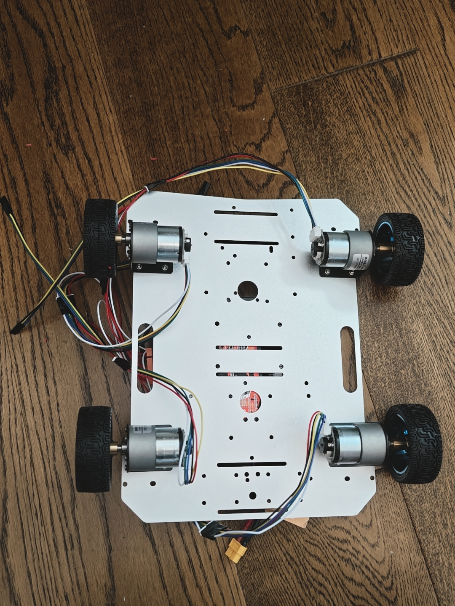
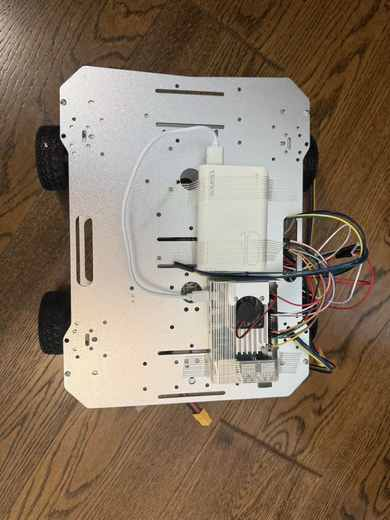
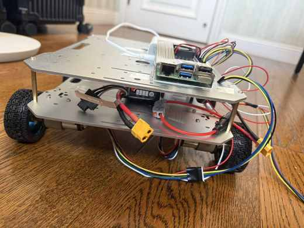
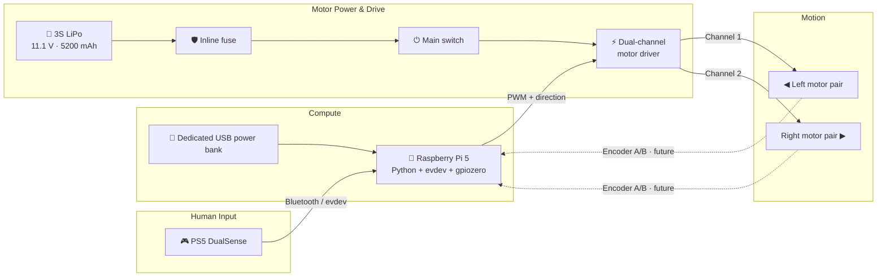
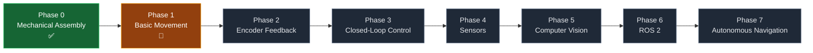
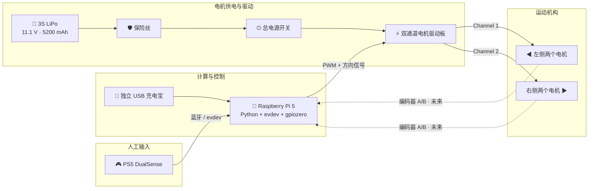

<div align="center">

# 🚗 RoverPi

### A Raspberry Pi 5–Powered Four-Wheel Robotic Rover
### 基于 Raspberry Pi 5 的四轮机器人小车

**Build safely · Verify honestly · Learn continuously · Drive autonomously**

**安全制作 · 真实验证 · 持续学习 · 走向自主**

[](#project-status)
[](#development-roadmap)
[](https://www.raspberrypi.com/products/raspberry-pi-5/)
[](https://www.python.org/)

[](#verified-motor-control)
[](#project-status)
[](#verification-boundary)
[](#dualsense-control)

### [English](#english) · [中文](#chinese) · [Latest Devlog](docs/devlog/2026-08-16-safety-and-shared-modules.md) · [Tests](tests/README.md) · [Roadmap](docs/roadmap.md)

</div>

---

<table>
  <tr>
    <td width="33%" align="center"><br><sub><b>Four-wheel chassis</b></sub></td>
    <td width="33%" align="center"><br><sub><b>Raspberry Pi upper deck</b></sub></td>
    <td width="33%" align="center"><br><sub><b>Control electronics</b></sub></td>
  </tr>
</table>

---

<a id="english"></a>

# 🇬🇧 English

## ✨ About RoverPi

**RoverPi** is a four-wheel differential-drive robotic rover built around a Raspberry Pi 5. The project is being developed as a sequence of small, observable, and repeatable engineering milestones:

> **First make the mobile base safe and dependable. Then add feedback, intelligence, and autonomy.**

This repository is not only a destination for finished software. It is also a living engineering journal containing:

- 🔌 verified wiring and power decisions;
- 🧪 focused hardware-test programs;
- 📓 bilingual development logs;
- 📷 build photographs and milestone evidence;
- 🧠 debugging lessons and learning notes;
- 🧭 a roadmap from first movement to autonomous navigation.

> [!IMPORTANT]
> RoverPi is an active learning and engineering project. A feature appears as **verified** only after it has been tested on the physical rover. Code that exists but has not been physically tested is labeled separately.

## 🎯 Current Objective

The current goal is to complete a safe, dependable, manually controlled mobile base:

```text
DualSense input
       ↓
Raspberry Pi 5
       ↓
Two-channel motor driver
       ↓
Left motors + Right motors
       ↓
Forward · Backward · Turn · Stop
```

Forward, backward, stop, and both spin turns are now physically verified. The immediate next milestone is confirming the disconnect fail-safe on the rover, followed by controller discovery and standalone operation without an active SSH session.

<a id="project-status"></a>

## 📊 Project Status

**Last updated: August 16, 2026**

| Area | Status | What is true today |
|---|:---:|---|
| Mechanical platform | ✅ Complete | Four-wheel, two-level aluminum chassis assembled |
| Raspberry Pi installation | ✅ Complete | Raspberry Pi 5 and dedicated USB power bank mounted on upper deck |
| Protected motor-power path | ✅ Installed | 3S LiPo motor supply routed through fuse and main switch |
| Driver Channel 1 | ✅ Verified | Left-side forward, backward, and stop at 30% PWM |
| Driver Channel 2 | ✅ Verified | Right-side forward, backward, and stop at 30% PWM |
| Four-wheel movement | ✅ Verified | Forward → stop → backward → stop sequence completed |
| DualSense input | ✅ Verified | Bluetooth, Linux input, and Python `evdev` data validated |
| DualSense driving | ✅ Verified | Forward, backward, stop, and both spin turns driven from the controller |
| Left/right turning | ✅ Verified | Differential spin turns confirmed on the rover after August 10 |
| Controller discovery | ⏳ Pending | Current tests still require the active `/dev/input/eventX` path |
| Disconnect fail-safe | 🧪 Test next | Watchdog implemented on August 16; stops both channels when the controller device disappears |
| Encoder feedback | 🗓️ Planned | Wheel direction, RPM, distance, and odometry |
| Autonomous navigation | 🔭 Future | Added after the mobile base is dependable |

### Milestone trail

```mermaid
flowchart LR
    A["Chassis assembled<br/>✅"] --> B["Channel 1<br/>✅"]
    B --> C["DualSense input<br/>✅"]
    C --> D["Channel 2<br/>✅"]
    D --> E["Four-wheel motion<br/>✅"]
    E --> F["Gamepad FWD/REV/STOP<br/>✅"]
    F --> G["Spin turns<br/>✅"]
    G --> H["Disconnect fail-safe<br/>🧪 Next"]
    H --> I["Standalone, no SSH<br/>⏳"]

    classDef done fill:#166534,color:#fff,stroke:#22c55e,stroke-width:2px;
    classDef next fill:#92400e,color:#fff,stroke:#f59e0b,stroke-width:2px;
    classDef pending fill:#1f2937,color:#fff,stroke:#64748b,stroke-width:2px;
    class A,B,C,D,E,F,G done;
    class H next;
    class I pending;
```



## 🧩 System Architecture



> [!CAUTION]
> The 11.1 V LiPo must never be connected directly to the Raspberry Pi. The Pi and motor side use separate positive power domains. Keep the verified signal-reference arrangement, lift the wheels before new motor tests, and keep the main power switch within reach.

## 🔩 Core Hardware

| Component | Specification | Role |
|---|---|---|
| Main computer | Raspberry Pi 5 | Motor commands and future robotics software |
| Chassis | 305 × 230 mm, dual-level aluminum, 4WD | Mechanical platform |
| Motors | 4 × 12 V, 320 RPM encoder DC gear motors | Four-wheel propulsion |
| Gear ratio | 30:1 | Torque and speed balance |
| Encoders | Integrated quadrature A/B | Future wheel feedback and odometry |
| Wheels | 4 × 65 mm high-friction wheels | Traction and ground contact |
| Motor driver | WHEELTEC MOS high-current dual-channel driver | Converts control signals into motor power |
| Motor battery | G-Tech 3S LiPo, 11.1 V, 5200 mAh, 50C | Motor-side power source |
| Pi power | Dedicated USB power bank | Independent Raspberry Pi supply |
| Safety hardware | Inline fuse + main switch | Motor-power protection and physical cutoff |
| Controller | PS5 DualSense | Manual driving input over Bluetooth |

See the detailed [hardware notes](docs/hardware.md) and [bill of materials](hardware/bom.md).

<a id="verified-motor-control"></a>

## ⚙️ Verified Motor Control

All GPIO references use **BCM numbering**.

| Side | Driver channel | PWM | Direction A | Direction B | Rover-forward polarity |
|---|---|---:|---:|---:|---|
| Left motors | Channel 1 | GPIO12 | GPIO23 | GPIO24 | `INA1 off` · `INB1 on` |
| Right motors | Channel 2 | GPIO13 | GPIO5 | GPIO6 | `INA2 on` · `INB2 off` |

### Movement truth table

| Command | Left side | Right side | Physical status |
|---|---|---|:---:|
| ⏹️ Stop | Direction inputs off, PWM 0 | Direction inputs off, PWM 0 | ✅ Verified |
| ⬆️ Forward | Forward | Forward | ✅ Verified |
| ⬇️ Backward | Backward | Backward | ✅ Verified |
| ↪️ Spin left | Backward | Forward | ✅ Verified |
| ↩️ Spin right | Forward | Backward | ✅ Verified |

The left and right motors face opposite directions on the chassis, so rover-forward requires opposite electrical direction states on the two channels. The repository records explicit verified pin states rather than trusting a generic library method name.

Full wiring, physical header pins, and safety boundaries are documented in [`docs/wiring.md`](docs/wiring.md).

<a id="dualsense-control"></a>

## 🎮 DualSense Control

The PS5 DualSense is connected through Bluetooth and read in Python with `evdev`.

### Observed left-stick values

| Reader | Left / Forward | Center | Right / Backward |
|---|---:|---:|---:|
| `evdev ABS_X` | Left ≈ `0` | ≈ `128` | Right ≈ `255` |
| `evdev ABS_Y` | Forward ≈ `0` | ≈ `128` | Backward ≈ `255` |
| `jstest` Y | Forward `-32767` | `0` | Backward `+32767` |

> [!NOTE]
> `jstest` and Python `evdev` expose different numeric representations. Their signs and thresholds must not be mixed.

Linux assigns `/dev/input/eventX` dynamically. `event11` was valid during one verified session but is not a permanent controller path. See the [setup guide](docs/setup.md) and [DualSense debugging note](notes/debugging/dualsense-input.md).

## 🧪 Test Suite

The `tests/` directory contains intentionally small, teaching-oriented hardware checks. Every Python file explains what the next line or block does.

Two shared modules hold everything that used to be copied into all seven tests:

| Module | Contents |
|---|---|
| `rover_pins.py` | Verified BCM pin map, verified polarities, 30% test speed, movement commands |
| `rover_input.py` | DualSense path, observed `0..255` calibration, shared dead zone, reading loop |

| Test | Purpose | Status |
|---|---|:---:|
| `test_gamepad_input.py` | Read stick directions without moving motors | ✅ Verified |
| `test_motor_channel1.py` | Run left motors forward briefly | ✅ Verified |
| `test_gamepad_motor_left.py` | Control left side from DualSense Y axis | ✅ Verified |
| `test_motor_channel2.py` | Run right motors forward briefly | ✅ Verified |
| `test_motor_channel2_backward.py` | Run right motors backward briefly | ✅ Verified |
| `test_all_motors.py` | Four-wheel forward/stop/backward sequence | ✅ Verified |
| `test_gamepad_all_motors.py` | Full left-stick driving | ✅ Verified |

> [!NOTE]
> The verified results above were produced before the August 16 safety changes
> (single dead zone, dominant-axis rule, protected reversal, disconnect
> watchdog). The movement sequences and pin states are unchanged, but the
> scripts in their current form await a confirmation run — in particular, the
> axis the stick is pushed furthest along now decides the command. See
> [`tests/README.md`](tests/README.md).

> [!WARNING]
> These are manual hardware tests, not ordinary automated unit tests. Read [`tests/README.md`](tests/README.md), lift all wheels, verify the current event path, and inspect wiring before running them.

<a id="verification-boundary"></a>

## 🔍 Verification Boundary

### ✅ Physically verified

- Channel 1 left-side forward, backward, and stop;
- Channel 2 right-side forward, backward, and stop;
- four-wheel forward → stop → backward → stop at 30% PWM;
- DualSense-controlled four-wheel forward, backward, and stop;
- spin left: left side backward + right side forward;
- spin right: left side forward + right side backward.

### 🧪 Implemented, awaiting physical validation

- a single 35-count dead zone shared by the rehearsal and driving tests;
- the dominant-axis rule from the rehearsal script, so a mostly-forward push drives forward and a mostly-sideways push turns;
- a 50 ms zero-power pause before every direction reversal;
- stop-on-disconnect: both channels stop when the controller device disappears.

### ⏳ Not implemented yet

- automatic DualSense device discovery;
- stale-input timeout (a held stick emits no events, so this needs its own test);
- analog tank mixing for smooth turns;
- production startup and no-SSH standalone operation.

## 🗂️ Repository Map

```text
RoverPi/
├── README.md                         # Project home / bilingual overview
├── LICENSE                           # MIT, software and documentation only
├── requirements.txt                  # gpiozero, evdev, lgpio
├── tests/                            # Focused hardware-validation scripts
│   ├── README.md                     # Safety, order, and verification status
│   ├── rover_pins.py                 # Verified pin map, polarities, commands
│   ├── rover_input.py                # DualSense calibration and reading loop
│   └── test_*.py                     # Teaching-oriented Python tests
├── docs/
│   ├── devlog/                       # Bilingual milestone logs
│   ├── hardware.md                   # Physical layout and power domains
│   ├── wiring.md                     # Verified GPIO and polarity map
│   ├── setup.md                      # Pi and DualSense setup
│   └── roadmap.md                    # Detailed phase checklist
├── hardware/
│   └── bom.md                        # Bill of materials
├── notes/
│   └── debugging/                    # Problems, causes, fixes, lessons
└── photos/                           # Build photographs by date/milestone
```

Runtime modules will move into a formal `src/` structure only after turning, device discovery, and safety behavior are stable enough to deserve a reusable control layer.

<a id="development-roadmap"></a>

## 🧭 Development Roadmap



| Phase | Focus | State |
|---:|---|:---:|
| 0 | Mechanical assembly | ✅ Complete |
| 1 | Basic movement, manual control, and safety | 🔨 Active |
| 2 | Quadrature encoder feedback | 🗓️ Planned |
| 3 | PID wheel-speed control and odometry | 🗓️ Planned |
| 4 | Distance sensors and IMU | 🔭 Future |
| 5 | Camera and computer vision | 🔭 Future |
| 6 | ROS 2 software architecture | 🔭 Future |
| 7 | Localization, SLAM, planning, and autonomy | 🔭 Future |

The detailed exit criteria for every phase are maintained in [`docs/roadmap.md`](docs/roadmap.md).

## 📓 Latest Development Log

### August 16, 2026 — Safety consistency and shared modules

A code review found that the read-only rehearsal test and the test that drove all four wheels disagreed on both the dead zone and the rule for choosing an axis, that direction reversals flipped a pin while the motors were still turning, and that a dropped Bluetooth link left the last PWM command applied indefinitely. All four were fixed, and the duplicated pin definitions were extracted into `tests/rover_pins.py` and `tests/rover_input.py`. No verified pin state, sequence, or speed was changed.

➡️ **[Read the full bilingual development log](docs/devlog/2026-08-16-safety-and-shared-modules.md)** · [previous log](docs/devlog/2026-08-10.md)

## 🚀 Next Actions

1. ✅ Confirm the refactored scripts still reproduce every verified movement.
2. 🕹️ Re-check turning under the dominant-axis rule.
3. 🛑 Confirm immediate stop after releasing the stick in every direction.
4. 🧯 Physically verify the disconnect watchdog by powering the controller off mid-drive.
5. 🔎 Discover the DualSense by identity instead of fixed `eventX`.
6. 🔌 Run safely without an active SSH session.
7. 🎚️ Add analog differential mixing for smoother steering.

## 💡 Engineering Principles

1. **Make it safe before making it fast.**
2. **Verify one subsystem at a time.**
3. **Document what physically happened—not what code merely suggests.**
4. **Keep completed work separate from future plans.**
5. **Preserve every debugging lesson.**
6. **Let the repository mature with the rover.**

---

<a id="chinese"></a>

# 🇨🇳 中文

## ✨ RoverPi 项目简介

**RoverPi** 是一台以 Raspberry Pi 5 为主控的四轮差速机器人小车。整个项目按照可观察、可重复、可验证的小阶段逐步开发：

> **先把移动底盘做得安全可靠，再加入反馈、智能与自主能力。**

这个仓库不只是存放最终代码的地方，也是一份持续成长的工程记录，包含：

- 🔌 已验证的接线方式与电源设计；
- 🧪 单一目的、容易排错的硬件测试程序；
- 📓 中英双语开发日志；
- 📷 制作照片与阶段证据；
- 🧠 调试经验和学习笔记；
- 🧭 从第一次移动走向自主导航的路线图。

> [!IMPORTANT]
> RoverPi 仍在持续开发中。只有经过实体小车测试的功能才会标记为“已验证”；已经写入代码但尚未实测的功能会单独标明，绝不会混在已完成功能中。

## 🎯 当前目标

当前目标是完成一个安全、可靠、可以手动遥控的移动底盘：

```text
DualSense 手柄输入
         ↓
Raspberry Pi 5
         ↓
双通道电机驱动板
         ↓
左侧电机 + 右侧电机
         ↓
前进 · 后退 · 转向 · 停止
```

目前前进、后退、停止和左右原地转向都已完成实体测试。下一项里程碑是在实车上确认断线安全停车，之后再完成手柄自动发现和无 SSH 独立运行。

## 📊 项目状态

**最后更新：2026 年 8 月 16 日**

| 部分 | 状态 | 当前真实情况 |
|---|:---:|---|
| 机械底盘 | ✅ 已完成 | 四轮双层铝合金底盘已组装 |
| 树莓派安装 | ✅ 已完成 | Raspberry Pi 5 与独立 USB 充电宝安装在上层 |
| 电机保护供电 | ✅ 已安装 | 3S LiPo 经过保险丝与总开关为电机侧供电 |
| 驱动 Channel 1 | ✅ 已验证 | 左侧前进、后退、停止，30% PWM |
| 驱动 Channel 2 | ✅ 已验证 | 右侧前进、后退、停止，30% PWM |
| 四轮联动 | ✅ 已验证 | 已完成前进 → 停止 → 后退 → 停止 |
| DualSense 输入 | ✅ 已验证 | 蓝牙、Linux 输入与 Python `evdev` 均已验证 |
| DualSense 驾驶 | ✅ 已验证 | 手柄控制前进、后退、停止与左右原地转向均已实测 |
| 左右转向 | ✅ 已验证 | 8 月 10 日之后的一次驾驶中确认差速原地转向 |
| 手柄自动发现 | ⏳ 待完成 | 当前仍需填写本次连接的 `/dev/input/eventX` |
| 断线安全停车 | 🧪 下一项测试 | 8 月 16 日已实现看门狗：手柄设备节点消失时立即停止两路电机 |
| 编码器反馈 | 🗓️ 已规划 | 测量方向、转速、距离与里程 |
| 自主导航 | 🔭 未来阶段 | 移动底盘可靠后再加入 |

### 里程碑轨迹


## 🧩 系统架构



> [!CAUTION]
> 绝对不能把 11.1 V LiPo 直接连接到 Raspberry Pi。树莓派与电机侧使用独立的正极供电区域，并保持已经验证的信号参考地连接。新电机测试前必须架空轮子，并确保总电源开关触手可及。

## 🔩 核心硬件

| 元件 | 规格 | 用途 |
|---|---|---|
| 主控 | Raspberry Pi 5 | 电机命令与未来机器人软件 |
| 底盘 | 305 × 230 mm 双层铝合金四驱底盘 | 机械平台 |
| 电机 | 4 × 12 V、320 RPM 编码器直流减速电机 | 四轮驱动 |
| 减速比 | 30:1 | 平衡速度和扭矩 |
| 编码器 | 电机集成 AB 相正交编码器 | 未来轮速反馈与里程计 |
| 车轮 | 4 × 65 mm 高摩擦轮胎 | 接触地面并提供抓地力 |
| 电机驱动 | WHEELTEC MOS 大电流双通道驱动板 | 将控制信号转换为电机功率 |
| 电机电池 | G-Tech 3S LiPo，11.1 V，5200 mAh，50C | 电机侧动力电源 |
| 树莓派电源 | 独立 USB 充电宝 | 为 Raspberry Pi 单独供电 |
| 安全硬件 | 串联保险丝 + 总开关 | 电机电源保护与实体断电 |
| 遥控器 | PS5 DualSense | 通过蓝牙提供手动驾驶输入 |

详细资料请查看[硬件说明](docs/hardware.md)和[物料清单](hardware/bom.md)。

## ⚙️ 已验证电机控制

所有 GPIO 均采用 **BCM 编号**。

| 位置 | 驱动通道 | PWM | 方向 A | 方向 B | 小车前进极性 |
|---|---|---:|---:|---:|---|
| 左侧电机 | Channel 1 | GPIO12 | GPIO23 | GPIO24 | `INA1 off` · `INB1 on` |
| 右侧电机 | Channel 2 | GPIO13 | GPIO5 | GPIO6 | `INA2 on` · `INB2 off` |

### 运动真值表

| 命令 | 左侧 | 右侧 | 实测状态 |
|---|---|---|:---:|
| ⏹️ 停止 | 方向输入关闭，PWM 为 0 | 方向输入关闭，PWM 为 0 | ✅ 已验证 |
| ⬆️ 前进 | 前进 | 前进 | ✅ 已验证 |
| ⬇️ 后退 | 后退 | 后退 | ✅ 已验证 |
| ↪️ 原地左转 | 后退 | 前进 | ✅ 已验证 |
| ↩️ 原地右转 | 前进 | 后退 | ✅ 已验证 |

左右电机在底盘上的安装方向相反，所以小车前进时两路驱动需要相反的电气方向输入。仓库记录的是实体测试确认过的引脚状态，而不是依赖通用库函数名称来猜测方向。

完整 BCM/物理针脚、接线和安全边界请查看 [`docs/wiring.md`](docs/wiring.md)。

## 🎮 DualSense 控制

PS5 DualSense 通过蓝牙连接，并由 Python `evdev` 读取输入。

### 左摇杆实测数值

| 读取方式 | 左 / 前 | 中心 | 右 / 后 |
|---|---:|---:|---:|
| `evdev ABS_X` | 左 ≈ `0` | ≈ `128` | 右 ≈ `255` |
| `evdev ABS_Y` | 前 ≈ `0` | ≈ `128` | 后 ≈ `255` |
| `jstest` Y | 前 `-32767` | `0` | 后 `+32767` |

> [!NOTE]
> `jstest` 与 Python `evdev` 使用不同的数值表示方式，不能混用正负方向和阈值。

Linux 会动态分配 `/dev/input/eventX`。`event11` 只在某一次实测连接中有效，并不是永久手柄路径。详细连接步骤和排错经验请查看[设置说明](docs/setup.md)与[DualSense 调试笔记](notes/debugging/dualsense-input.md)。

## 🧪 测试代码

`tests/` 保存单一目的、容易理解和排错的硬件验证脚本。每个 Python 文件都包含教学式注释，说明下一行或下一组代码的作用。

原本被复制到 7 个测试文件里的引脚定义和手柄常量，现在集中在两个共享模块：

| 模块 | 内容 |
|---|---|
| `rover_pins.py` | 已验证的 BCM 引脚映射、方向极性、30% 测试速度与运动命令 |
| `rover_input.py` | DualSense 设备路径、实测 `0..255` 标定、统一死区与读取循环 |

| 测试文件 | 作用 | 状态 |
|---|---|:---:|
| `test_gamepad_input.py` | 只读取摇杆方向，不驱动电机 | ✅ 已验证 |
| `test_motor_channel1.py` | 左侧电机短暂前进 | ✅ 已验证 |
| `test_gamepad_motor_left.py` | DualSense Y 轴控制左侧 | ✅ 已验证 |
| `test_motor_channel2.py` | 右侧电机短暂前进 | ✅ 已验证 |
| `test_motor_channel2_backward.py` | 右侧电机短暂后退 | ✅ 已验证 |
| `test_all_motors.py` | 四轮前进/停止/后退流程 | ✅ 已验证 |
| `test_gamepad_all_motors.py` | 左摇杆控制全部四轮 | ✅ 已验证 |

> [!NOTE]
> 上表的"已验证"结果是 8 月 16 日安全改动之前实测的。运动顺序、引脚电平和 30% 速度
> 都没有改变，但当前版本的脚本还需要一次确认性重跑——特别是现在改成"摇杆往哪个方向
> 推得更多就执行哪个方向"。详见 [`tests/README.md`](tests/README.md)。

> [!WARNING]
> 这些是手动硬件测试，不是普通自动单元测试。运行前必须阅读 [`tests/README.md`](tests/README.md)、架空四轮、确认当前手柄 event 路径并检查所有接线。

## 🔍 验证边界

### ✅ 已完成实体测试

- Channel 1 左侧前进、后退和停止；
- Channel 2 右侧前进、后退和停止；
- 30% PWM 四轮前进 → 停止 → 后退 → 停止；
- DualSense 控制四轮前进、后退和停止；
- 原地左转：左侧后退 + 右侧前进；
- 原地右转：左侧前进 + 右侧后退。

### 🧪 已实现、等待实体测试

- 预演脚本与驾驶脚本共用同一个 35 计数死区；
- 采用预演脚本的主导轴规则：偏前推就前进，偏横推就转向，斜推不再误触发；
- 每次换向前先把两路 PWM 归零并等待 50 毫秒；
- 手柄断线自动停车：设备节点消失时立即关闭两路输出。

### ⏳ 尚未实现

- 自动发现 DualSense 主输入设备；
- 输入超时停车（摇杆保持不动时手柄不发事件，需要单独实测确认）；
- 模拟差速混合与平滑转向；
- 正式开机启动和无 SSH 独立运行。

## 🗂️ 仓库结构

```text
RoverPi/
├── README.md                         # 项目主页 / 中英双语概览
├── LICENSE                           # MIT，仅覆盖软件与文档
├── requirements.txt                  # gpiozero、evdev、lgpio
├── tests/                            # 单项硬件验证脚本
│   ├── README.md                     # 安全说明、顺序与验证状态
│   ├── rover_pins.py                 # 已验证引脚映射、极性与运动命令
│   ├── rover_input.py                # DualSense 标定与读取循环
│   └── test_*.py                     # 带教学注释的 Python 测试
├── docs/
│   ├── devlog/                       # 中英双语阶段日志
│   ├── hardware.md                   # 物理布局和供电区域
│   ├── wiring.md                     # 已验证 GPIO 与极性
│   ├── setup.md                      # 树莓派和手柄设置
│   └── roadmap.md                    # 详细阶段清单
├── hardware/
│   └── bom.md                        # 物料清单
├── notes/
│   └── debugging/                    # 问题、原因、解决方案与经验
└── photos/                           # 按日期和里程碑保存的照片
```

等转向、设备自动发现和安全停止足够稳定后，再把控制逻辑提取为正式 `src/` 运行模块，避免过早把实验代码包装成生产代码。

## 🧭 开发路线图


| 阶段 | 重点 | 状态 |
|---:|---|:---:|
| 0 | 机械组装 | ✅ 已完成 |
| 1 | 基础移动、手动控制与安全 | 🔨 进行中 |
| 2 | 正交编码器反馈 | 🗓️ 已规划 |
| 3 | PID 轮速控制与里程计 | 🗓️ 已规划 |
| 4 | 测距传感器与 IMU | 🔭 未来 |
| 5 | 摄像头与计算机视觉 | 🔭 未来 |
| 6 | ROS 2 软件架构 | 🔭 未来 |
| 7 | 定位、SLAM、规划与自主导航 | 🔭 未来 |

每个阶段的详细完成条件记录在 [`docs/roadmap.md`](docs/roadmap.md)。

## 📓 最新开发日志

### 2026 年 8 月 16 日——安全一致性与共享模块

一次代码审查发现：只读预演脚本和真正驱动四轮的脚本在死区和选轴规则上并不一致；换向时会在电机仍在转动的瞬间翻转方向引脚；蓝牙断开后上一条 PWM 命令会一直保持。四个问题全部修复，并把重复的引脚定义抽取到 `tests/rover_pins.py` 与 `tests/rover_input.py`。所有已验证的引脚电平、运动顺序和速度均未改动。

➡️ **[阅读完整中英双语开发日志](docs/devlog/2026-08-16-safety-and-shared-modules.md)** · [上一篇日志](docs/devlog/2026-08-10.md)

## 🚀 接下来要做什么

1. ✅ 确认重构后的脚本仍能复现全部已验证动作。
2. 🕹️ 按主导轴规则复查转向。
3. 🛑 确认每个方向松开摇杆后都能立即停止。
4. 🧯 行驶中关闭手柄电源，实测断线看门狗是否立即停车。
5. 🔎 根据设备身份自动寻找 DualSense，不再写死 `eventX`。
6. 🔌 验证无 SSH 连接时也能安全独立运行。
7. 🎚️ 加入模拟差速混合，实现更平滑的转向。

## 💡 工程原则

1. **先保证安全，再追求速度。**
2. **每次只验证一个子系统。**
3. **记录实体硬件真正发生的结果，而不是代码看起来应该发生的结果。**
4. **明确区分已经完成的功能与未来计划。**
5. **保存每一次调试学到的经验。**
6. **让仓库和 Rover 一起成长。**

---

<div align="center">

## 🚗 Build · Test · Learn · Improve · Repeat
## 制作 · 测试 · 学习 · 改进 · 再出发

**RoverPi — from first wheel movement to autonomous exploration.**

**RoverPi——从车轮第一次转动，走向自主探索。**

</div>
