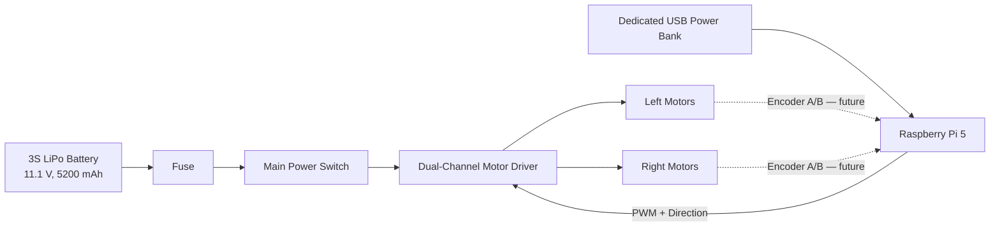
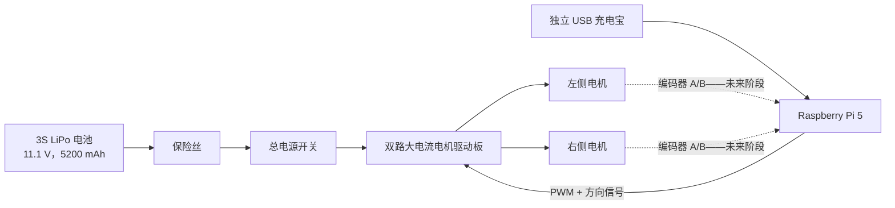
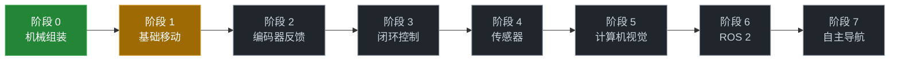

<div align="center">

# 🚗 RoverPi

### A Raspberry Pi 5–Powered Four-Wheel Robotic Rover  
### 基于 Raspberry Pi 5 的四轮机器人小车

**Built step by step—from first movement to autonomous navigation.**  
**从第一次移动开始，一步一步走向自主导航。**


[English](#english) · [中文](#中文)

</div>

---

<a id="english"></a>

# English

## 🌟 About the Project

**RoverPi** is a four-wheel robotic rover built around a Raspberry Pi 5. The project is intentionally being developed in small, verifiable stages: first make the rover move safely and reliably, then add encoder feedback, closed-loop control, sensors, computer vision, ROS 2, localization, and autonomous navigation.

This repository is more than a place for source code. It also records the rover's hardware, wiring, tests, photographs, research references, learning notes, and debugging experience. The goal is to preserve both the final system and the engineering journey behind it.

> [!IMPORTANT]
> RoverPi is an active learning and engineering project. Features listed in later phases are plans, not claims of completed functionality.

## 🎯 Current Objective

The current milestone is deliberately simple:

> **Safely control all four motors from the Raspberry Pi and achieve reliable forward, backward, left, right, and stop commands.**

Before adding advanced sensors or autonomy, the power system, motor driver, GPIO control signals, wiring, and emergency-stop behavior must all be verified.

## 🚦 Project Status

| Area | Status | Description |
|---|---:|---|
| Mechanical chassis | ✅ Assembled | Four-wheel, two-level aluminum chassis |
| Project repository | ✅ Ready | Organized structure for code, documentation, photos, and notes |
| Power distribution | 🔨 In progress | Motor battery path installed; Pi uses a dedicated USB power bank |
| Motor driver integration | 🔨 In progress | Pi-to-driver control wiring connected; powered validation pending |
| Basic movement | ⏳ Next milestone | Forward, backward, turning, and stop |
| Encoder feedback | 🗓️ Planned | Wheel speed, direction, and distance measurement |
| Sensors and autonomy | 🗓️ Future | Added only after the base rover is dependable |

**Legend:** ✅ complete · 🔨 in progress · ⏳ next · 🗓️ planned

## 🧩 System Overview



> [!CAUTION]
> Never connect the 11.1 V LiPo battery directly to the Raspberry Pi 5. The Pi is currently powered by a dedicated USB power bank on the upper deck. Before powered testing, verify the motor-driver control-interface ground/reference requirements against its documentation.

## 🔩 Core Hardware

| Component | Specification | Role |
|---|---|---|
| Main computer | Raspberry Pi 5 | High-level control and future robotics software |
| Chassis | 305 × 230 mm, dual-level aluminum, 4WD | Mechanical platform |
| Motors | 4 × 12 V, 320 RPM encoder DC gear motors | Four-wheel propulsion |
| Gear ratio | 30:1 | Torque and speed balance |
| Encoders | Quadrature A/B encoders integrated with motors | Future speed and odometry feedback |
| Wheels | 4 × 65 mm high-friction wheels | Ground contact and traction |
| Motor driver | WHEELTEC MOS high-current dual-channel driver | Drives the motors from low-power control signals |
| Battery | G-Tech 3S LiPo, 11.1 V, 5200 mAh, 50C | Main rover power source |
| Battery connector | XT60 | Main motor-power connection |
| Pi power source | Dedicated USB power bank | Independent mobile power for the Raspberry Pi 5 |
| Upper deck | Standoffs and second aluminum level | Mounts the Raspberry Pi 5 and its power bank |

Supporting parts include a fuse and fuse holder, main power switch, high-current wire, motor and encoder extension cables, GPIO wiring, heat-shrink tubing, cable ties, standoffs, screws, and a suitable 3S LiPo balance charger.

## 🔌 Motor and Encoder Wiring Reference

Each motor provides six wires:

| Function | Wire colors | Purpose |
|---|---|---|
| Motor terminals | Red / White | Motor power and direction |
| Encoder power | Black / Blue | Encoder supply and ground |
| Encoder signals | Yellow / Green | Quadrature channels A and B |

Wire colors must be verified against the motor documentation or by careful testing before final connection.

## 🗂️ Repository Structure

```text
RoverPi/
├── README.md                 # Project overview / 项目主页
├── src/                      # Rover runtime code
│   ├── motors/               # Motor control
│   ├── encoders/             # Encoder feedback
│   ├── sensors/              # Future sensors
│   ├── vision/               # Camera and computer vision
│   ├── navigation/           # Navigation logic
│   └── utils/                # Shared utilities
├── tests/                    # Focused hardware and software tests
├── docs/                     # RoverPi engineering documentation
│   ├── hardware.md
│   ├── wiring.md
│   ├── setup.md
│   └── roadmap.md
├── hardware/
│   ├── bom.md                # Bill of materials
│   ├── diagrams/             # Wiring and mechanical diagrams
│   └── datasheets/           # Manufacturer documentation
├── photos/                   # Build photographs by development stage
├── references/               # External resources with links and summaries
├── notes/                    # Personal learning and debugging notes
│   ├── electronics/
│   ├── motors/
│   ├── raspberry-pi/
│   ├── robotics/
│   ├── ros2/
│   └── debugging/
└── scripts/                  # Development and maintenance helpers
```

### Where should new material go?

| Material | Location |
|---|---|
| Code that runs on the rover | `src/` |
| One-purpose hardware or software checks | `tests/` |
| Rover-specific setup, wiring, and design decisions | `docs/` |
| Parts, datasheets, and hardware diagrams | `hardware/` |
| Progress and build photographs | `photos/` |
| Useful external tutorials, papers, and links | `references/` |
| Knowledge learned and personal explanations | `notes/` |
| Problems, causes, fixes, and lessons | `notes/debugging/` |

## 🛣️ Development Roadmap


### Phase 0 — Mechanical Assembly ✅

- Assemble the chassis
- Mount four motors and wheels
- Install the upper deck
- Prepare mounting space for the battery and electronics

### Phase 1 — Basic Movement 🔨

- Build a protected power-distribution path
- Install the Raspberry Pi and motor driver ✅
- Connect the Raspberry Pi-to-driver control wiring ✅
- Test one motor at a time
- Connect and verify all four motors
- Implement forward, backward, left, right, and stop
- Confirm safe startup, shutdown, and emergency stopping

**Milestone:** RoverPi moves reliably under Raspberry Pi control.

### Phase 2 — Encoder Feedback 🗓️

- Read quadrature A/B signals
- Determine wheel direction
- Measure wheel RPM and traveled distance
- Validate readings across all four wheels

### Phase 3 — Closed-Loop Motor Control 🗓️

- Implement wheel-speed PID control
- Synchronize left and right wheel speeds
- Improve straight-line driving
- Begin wheel odometry

### Phase 4 — Sensors 🗓️

Potential additions include distance sensors, an IMU, and other modules selected according to the rover's needs. The exact sensor set remains intentionally open.

### Phase 5 — Computer Vision 🗓️

- Integrate a Raspberry Pi camera
- Explore OpenCV and visual perception
- Add task-specific vision only after the mobile base is stable

### Phase 6 — ROS 2 🗓️

- Separate motors, encoders, sensors, and camera into ROS 2 nodes
- Publish velocity and sensor data
- Build a maintainable robotics software architecture

### Phase 7 — Autonomous Navigation 🗓️

- Sensor fusion and localization
- Mapping and SLAM
- Path planning and obstacle avoidance
- Autonomous navigation experiments

## 📝 Development Log

Each meaningful build session is recorded in `docs/devlog/` with completed work, current state, photographs, safety notes, and next steps.

### Latest entry — August 7–8, 2026

Upgraded RoverPi to a two-level chassis, mounted the Raspberry Pi 5 and its dedicated USB power bank on the upper deck, and connected the Pi-to-motor-driver control wiring. These are completed installation steps; power-on and motor-movement validation are still pending.

➡️ **[Read the full bilingual development log](docs/devlog/2026-08-07-08.md)**

## 📸 Build Journal

Development photos will be stored in `photos/` and grouped by milestone—for example chassis assembly, power system, electronics installation, first movement, encoder testing, and future sensor upgrades.

This creates a visual engineering journal showing how RoverPi evolves over time. 📷🔧🚗

## 📚 Engineering Notes and References

- **`references/`** stores links and short summaries of useful external resources. Third-party material should not be copied into the repository unless its license permits it.
- **`notes/`** stores original explanations of newly learned concepts such as PWM, GPIO, H-bridges, encoders, PID control, I²C, UART, odometry, ROS 2, and SLAM.
- **`notes/debugging/`** records each problem, root cause, solution, and lesson learned.

## 🤝 Project Philosophy

1. **Make it safe before making it fast.**
2. **Verify one subsystem at a time.**
3. **Document what was actually built.**
4. **Separate completed work from future plans.**
5. **Learn from every failure and preserve the lesson.**
6. **Let the repository grow with the rover.**

---

<a id="中文"></a>

# 中文

## 🌟 项目简介

**RoverPi** 是一台以 Raspberry Pi 5 为主控的四轮机器人小车。项目将按照可以验证的小阶段持续开发：首先让小车安全、可靠地移动，然后逐步加入编码器反馈、闭环控制、传感器、计算机视觉、ROS 2、定位与自主导航功能。

这个仓库不只是存放代码的地方。它还会记录小车的硬件、接线、测试、照片、参考资料、学习笔记和调试经验。我们希望保留下来的不仅是最后完成的系统，也包括它背后的整个工程过程。

> [!IMPORTANT]
> RoverPi 目前仍在持续开发中。后续阶段列出的功能属于规划，并不代表已经完成。

## 🎯 当前目标

目前的里程碑刻意保持简单：

> **通过 Raspberry Pi 安全控制四个电机，可靠实现前进、后退、左转、右转和停止。**

在增加高级传感器或自主功能之前，需要先验证供电系统、电机驱动板、GPIO 控制信号、线路连接以及紧急停止行为。

## 🚦 项目状态

| 部分 | 状态 | 说明 |
|---|---:|---|
| 机械底盘 | ✅ 已完成 | 四轮双层铝合金底盘 |
| 项目仓库 | ✅ 已完成 | 已建立代码、文档、照片和笔记结构 |
| 电源分配 | 🔨 进行中 | 电机电池线路已安装；树莓派使用独立 USB 充电宝 |
| 电机驱动集成 | 🔨 进行中 | 树莓派至驱动板控制线已连接；等待通电验证 |
| 基础移动 | ⏳ 下一里程碑 | 前进、后退、转向和停止 |
| 编码器反馈 | 🗓️ 已规划 | 测量轮速、方向和距离 |
| 传感器与自主功能 | 🗓️ 未来计划 | 基础小车可靠后再逐步加入 |

**状态说明：** ✅ 已完成 · 🔨 进行中 · ⏳ 下一步 · 🗓️ 已规划

## 🧩 系统架构



> [!CAUTION]
> 绝对不能把 11.1 V LiPo 电池直接连接到 Raspberry Pi 5。目前树莓派由上层平台上的独立 USB 充电宝供电。通电测试前，应依据驱动板资料确认控制接口所需的地线/参考地连接。

## 🔩 核心硬件

| 元件 | 规格 | 作用 |
|---|---|---|
| 主控 | Raspberry Pi 5 | 高层控制与未来机器人软件 |
| 底盘 | 305 × 230 mm 双层铝合金四驱底盘 | 机械平台 |
| 电机 | 4 × 12 V、320 RPM 编码器直流减速电机 | 四轮驱动 |
| 减速比 | 30:1 | 平衡扭矩与速度 |
| 编码器 | 电机集成 AB 相增量编码器 | 后续轮速与里程反馈 |
| 轮胎 | 4 × 65 mm 高摩擦轮 | 接触地面并提供抓地力 |
| 电机驱动 | WHEELTEC MOS 大电流双路驱动板 | 通过低功率信号驱动电机 |
| 电池 | G-Tech 3S LiPo，11.1 V、5200 mAh、50C | 小车主动力电源 |
| 电池接口 | XT60 | 电机主电源连接 |
| 树莓派电源 | 独立 USB 充电宝 | 为 Raspberry Pi 5 提供独立移动电源 |
| 上层平台 | 铜柱与第二层铝板 | 安装 Raspberry Pi 5 及其充电宝 |

辅助配件包括保险丝与保险丝座、总电源开关、大电流电源线、电机与编码器延长线、GPIO 连接线、热缩管、扎带、铜柱、螺丝以及合适的 3S LiPo 平衡充电器。

## 🔌 电机与编码器线材参考

每个电机共有六根线：

| 功能 | 线材颜色 | 用途 |
|---|---|---|
| 电机端子 | 红 / 白 | 电机供电与转向 |
| 编码器供电 | 黑 / 蓝 | 编码器电源与地 |
| 编码器信号 | 黄 / 绿 | AB 相正交信号 |

最终连接前，应通过电机资料或谨慎测试确认实际线序。

## 🗂️ 仓库结构

```text
RoverPi/
├── README.md                 # 项目主页
├── src/                      # 小车实际运行的代码
│   ├── motors/               # 电机控制
│   ├── encoders/             # 编码器反馈
│   ├── sensors/              # 后续传感器
│   ├── vision/               # 摄像头与计算机视觉
│   ├── navigation/           # 导航逻辑
│   └── utils/                # 公共工具
├── tests/                    # 单项硬件与软件测试
├── docs/                     # RoverPi 自有工程文档
│   ├── hardware.md
│   ├── wiring.md
│   ├── setup.md
│   └── roadmap.md
├── hardware/
│   ├── bom.md                # 物料清单
│   ├── diagrams/             # 接线图与机械图
│   └── datasheets/           # 厂商资料
├── photos/                   # 按阶段存放的项目照片
├── references/               # 外部资料链接与总结
├── notes/                    # 个人学习与调试笔记
│   ├── electronics/
│   ├── motors/
│   ├── raspberry-pi/
│   ├── robotics/
│   ├── ros2/
│   └── debugging/
└── scripts/                  # 开发与维护辅助脚本
```

### 新内容应该放在哪里？

| 内容 | 存放位置 |
|---|---|
| 在小车上实际运行的代码 | `src/` |
| 单独验证硬件或软件的测试 | `tests/` |
| RoverPi 自己的安装、接线与设计决定 | `docs/` |
| 零件、数据手册与硬件图 | `hardware/` |
| 制作过程和阶段进度照片 | `photos/` |
| 有用的外部教程、论文和链接 | `references/` |
| 新学到的知识与自己的理解 | `notes/` |
| 问题、原因、解决方法与经验 | `notes/debugging/` |

## 🛣️ 开发路线图



### 阶段 0 — 机械组装 ✅

- 组装底盘
- 安装四个电机和轮胎
- 安装上层平台
- 为电池和电子元件预留安装位置

### 阶段 1 — 基础移动 🔨

- 建立带保护的电源分配线路
- 安装 Raspberry Pi 和电机驱动板 ✅
- 连接 Raspberry Pi 至驱动板的控制线 ✅
- 逐个测试电机
- 连接并验证全部四个电机
- 实现前进、后退、左转、右转和停止
- 验证安全启动、关机和紧急停止

**里程碑：** RoverPi 能够在 Raspberry Pi 控制下可靠移动。

### 阶段 2 — 编码器反馈 🗓️

- 读取 AB 相正交信号
- 判断车轮旋转方向
- 测量车轮 RPM 和行驶距离
- 验证四个车轮的读数

### 阶段 3 — 电机闭环控制 🗓️

- 实现车轮速度 PID 控制
- 同步左右车轮速度
- 提高直线行驶能力
- 开始建立轮式里程计

### 阶段 4 — 传感器 🗓️

根据小车的实际需求，可能加入测距传感器、IMU 等模块。具体传感器组合暂时保持开放，避免过早限制项目方向。

### 阶段 5 — 计算机视觉 🗓️

- 集成 Raspberry Pi 摄像头
- 学习并应用 OpenCV 与视觉感知
- 在移动底盘稳定后再增加具体视觉任务

### 阶段 6 — ROS 2 🗓️

- 将电机、编码器、传感器与摄像头拆分为 ROS 2 节点
- 发布速度和传感器数据
- 建立易于维护的机器人软件架构

### 阶段 7 — 自主导航 🗓️

- 传感器融合与定位
- 地图构建与 SLAM
- 路径规划与避障
- 自主导航实验

## 📝 开发日志

每一次有实际进展的制作过程都会记录在 `docs/devlog/` 中，包括当天完成的工作、当前状态、项目照片、安全提醒和下一步计划。

### 最新记录 — 2026 年 8 月 7–8 日

这两天将 RoverPi 升级为双层底盘，把 Raspberry Pi 5 和独立 USB 充电宝安装到上层平台，并连接了树莓派至电机驱动板的控制线。这些安装步骤已经完成，但尚未完成通电与电机移动验证。

➡️ **[查看完整的中英双语开发日志](docs/devlog/2026-08-07-08.md)**

## 📸 成长相册

项目照片会存放在 `photos/` 中，并按照里程碑分类，例如底盘组装、电源系统、电子元件安装、第一次移动、编码器测试和后续传感器升级。

这将形成一份可视化工程日志，完整展示 RoverPi 随时间成长的过程。📷🔧🚗

## 📚 工程笔记与参考资料

- **`references/`** 保存有用外部资料的链接和简短总结。除非许可证允许，否则不直接复制第三方内容到仓库。
- **`notes/`** 保存自己对 PWM、GPIO、H 桥、编码器、PID、I²C、UART、里程计、ROS 2 和 SLAM 等知识的理解。
- **`notes/debugging/`** 记录每一个问题、根本原因、解决方案和最终学到的经验。

## 🤝 项目原则

1. **先保证安全，再追求速度。**
2. **每次只验证一个子系统。**
3. **只记录真正完成的内容。**
4. **明确区分当前成果和未来计划。**
5. **从每一次失败中学习，并把经验保存下来。**
6. **让仓库与 Rover 一起成长。**

---

<div align="center">

### 🚗 Build. Test. Learn. Improve. Repeat.  
### 制作 · 测试 · 学习 · 改进 · 再出发

</div>
