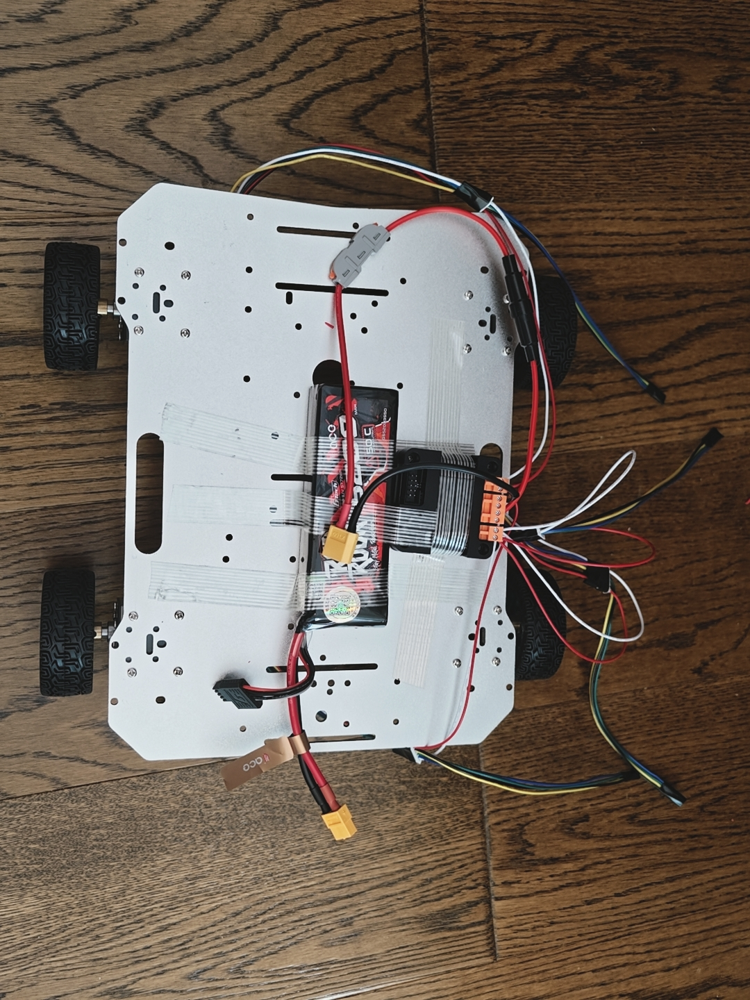

# Devlog — 2026-08-06

[English](#english) · [中文](#中文)

---

## English

### Chassis, power, and motor-driver installation

Today the RoverPi mechanical and high-current electrical assembly made an important step forward.

### Completed

- Installed all four encoder DC gear motors and wheels on the aluminum chassis.
- Mounted the 3S LiPo battery on the chassis.
- Mounted the dual-channel motor driver.
- Added an inline fuse to the main battery power path for short-circuit and overcurrent protection.
- Connected the red and white motor leads to the motor-driver output terminals.
- Routed the motor and encoder cables in preparation for later control wiring and testing.

### Current state

The major mechanical components and high-current motor wiring are now physically installed. The rover has **not yet been recorded as powered on or moving successfully**. Raspberry Pi power regulation, control-signal wiring, connection checks, and controlled motor tests remain to be completed.

### Photos

#### Battery, fuse, and motor-driver installation

#### Aluminum chassis, four motors, and wheels

### Next steps

- Secure and tidy the wiring before applying power.
- Verify polarity, fuse rating, terminal tightness, and common-ground requirements.
- Add a suitable regulated 5 V power path for the Raspberry Pi 5.
- Connect the Raspberry Pi control signals to the motor driver.
- Raise the wheels off the ground and test one motor channel at a time.
- Confirm stop behavior before attempting the first movement test.

> [!CAUTION]
> The 11.1 V LiPo battery must never be connected directly to the Raspberry Pi 5. Disconnect the battery while changing wiring, and perform the first powered motor tests with the wheels lifted clear of the ground.

---

## 中文

### 底盘、电源与电机驱动板安装

今天，RoverPi 的机械结构和大电流电气部分取得了一个重要进展。

### 今日完成

- 将四个带编码器的直流减速电机和轮胎安装到铝合金底盘上。
- 将 3S LiPo 电池固定到底盘上。
- 安装双路大电流电机驱动板。
- 在电池主电源线路中加入串联保险丝，用于短路和过流保护。
- 将各电机的红线和白线接入电机驱动板输出端子。
- 初步整理电机线与编码器线，为后续控制接线和测试做准备。

### 当前状态

主要机械部件和电机大电流线路已经完成物理安装。目前**尚未记录为已经成功通电或移动**。接下来还需要完成 Raspberry Pi 稳压供电、控制信号接线、线路检查以及受控电机测试。

### 项目照片

#### 电池、保险丝与电机驱动板安装

#### 铝合金底盘、四个电机与轮胎

### 下一步

- 通电前固定并进一步整理线路。
- 检查正负极、保险丝规格、接线端子松紧程度和共地要求。
- 为 Raspberry Pi 5 增加合适的 5 V 稳压供电线路。
- 将 Raspberry Pi 控制信号连接到电机驱动板。
- 让车轮离地，逐个测试电机通道。
- 确认停止功能可靠后，再进行第一次移动测试。

> [!CAUTION]
> 绝对不能把 11.1 V LiPo 电池直接连接到 Raspberry Pi 5。修改接线时必须断开电池；第一次电机通电测试时，应先将车轮架空。
