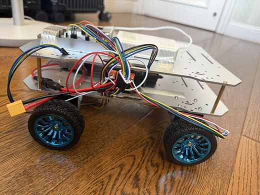

# Devlog — 2026-08-07–08

[English](#english) · [中文](#中文)

---

## English

### Two-level chassis and Raspberry Pi integration

This entry combines the RoverPi build work completed on August 7 and August 8, 2026.

### Completed

- Upgraded the rover from a single-level chassis to a two-level chassis.
- Mounted the Raspberry Pi 5 on the upper deck.
- Mounted a dedicated USB power bank for the Raspberry Pi on the upper deck.
- Connected the Raspberry Pi to the motor driver with the control ribbon/jumper wiring.
- Kept the Raspberry Pi power source separate from the 3S LiPo motor-power path.

### Current state

The mechanical upgrade and the listed physical installations and connections are complete. The rover is **not yet documented as successfully powered on or moving**. The exact GPIO map, driver logic-interface requirements, control signals, motor directions, stop behavior, and full movement still need controlled verification.

### Photos

#### Upper-deck top view

#### Two-level chassis side view

#### Raspberry Pi and control wiring

### Next steps

- Record and double-check the exact GPIO-to-driver pin map.
- Verify the driver logic voltage and signal-ground/reference requirements.
- Secure the upper-deck hardware and provide strain relief for the control wiring.
- Inspect all power polarity and terminal connections.
- With the wheels lifted, verify stop behavior and test one motor channel at a time.
- Record power-on and movement results only after successful testing.

> [!CAUTION]
> Keep the 11.1 V LiPo motor supply isolated from the Raspberry Pi positive supply. Disconnect power before changing wiring.

---

## 中文

### 双层底盘与 Raspberry Pi 集成

本文合并记录 RoverPi 在 2026 年 8 月 7 日和 8 月 8 日完成的制作工作。

### 已完成

- 将小车从单层底盘升级为双层底盘。
- 将 Raspberry Pi 5 安装到上层平台。
- 将树莓派专用 USB 充电宝安装到上层平台。
- 使用排线/杜邦控制线连接 Raspberry Pi 与电机驱动板。
- 保持树莓派供电与 3S LiPo 电机动力线路相互独立。

### 当前状态

机械升级以及上述物理安装和连接已经完成。当前**尚未记录为已经成功通电或移动**。具体 GPIO 映射、驱动板逻辑接口要求、控制信号、电机方向、停止行为及完整移动功能仍需受控验证。

### 项目照片

#### 上层平台俯视图

#### 双层底盘侧视图

#### Raspberry Pi 与控制线

### 下一步

- 记录并复查 GPIO 至驱动板的准确引脚映射。
- 确认驱动板逻辑电平和信号地/参考地要求。
- 固定上层硬件，并为控制线提供应力释放。
- 检查全部电源正负极和端子连接。
- 将车轮架空，先验证停止行为，再逐个测试电机通道。
- 只有测试成功后，才记录通电和移动结果。

> [!CAUTION]
> 保持 11.1 V LiPo 电机电源与树莓派正极供电相互隔离。更改接线前必须断电。
